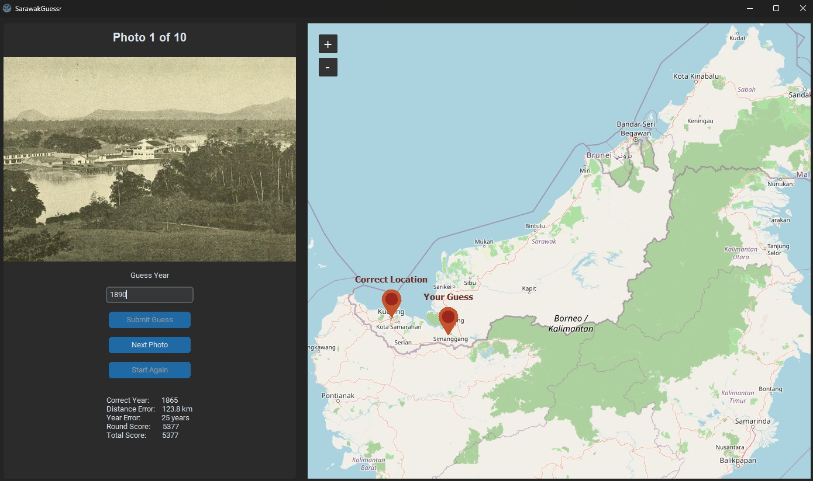
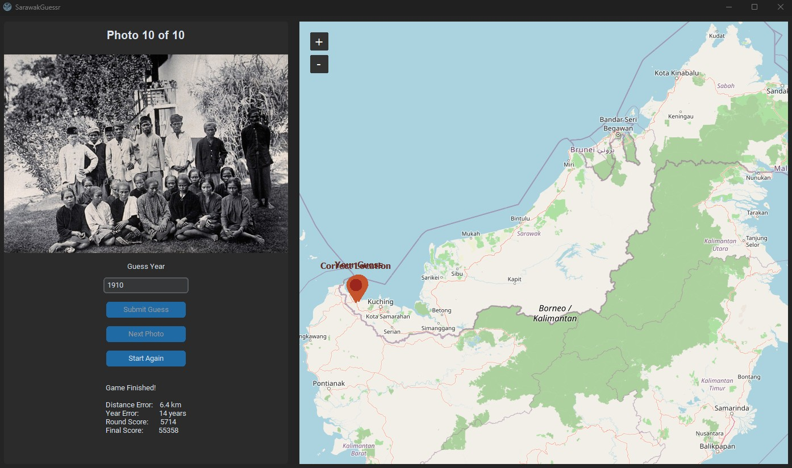

# SarawakGuessr



A desktop geography game inspired by **TimeGuessr**, where players identify the locations of historical photographs taken across Sarawak, Malaysia.

Instead of modern Street View images, SarawakGuessr challenges players to explore Sarawak's rich history by guessing where historical photographs were originally captured. The project was developed as a personal exercise to explore Python GUI development while promoting an appreciation of Sarawak's historical heritage.

> **Project Status:** Initial public release

---

## Features

* Interactive map for selecting guess locations
* Historical photographs with metadata, estimated years, and geographic coordinates
* Year estimation challenge alongside location guessing
* Distance calculation using the Haversine formula
* Score calculation based on guess accuracy
* Multiple rounds featuring a curated collection of historical photographs
* Desktop interface built with CustomTkinter
* Zoomable and draggable map

---

## Screenshots

### Result



---

## Demo


---

## Installation

### Clone the repository

```bash
git clone https://github.com/KazHkm/SarawakGuessr.git
cd SarawakGuessr
```

### Install the required packages

```bash
pip install -r requirements.txt
```

### Run the game

```bash
python sarawakguessr.py
```

---

## Technologies Used

* Python
* CustomTkinter
* TkinterMapView
* Pillow (PIL)

---

## Project Structure

```text
SarawakGuessr/
│
├── sarawakguessr.py       # Main application
├── photos.py              # Historical photo database
├── images/                # Historical photographs used in the game
├── assets/                # Screenshots and demo GIF
├── requirements.txt
├── README.md
└── LICENSE
```

---

## How to Play

1. Launch the application.
2. A historical photograph from Sarawak is displayed.
3. Examine the photograph for geographical and historical clues.
4. Enter your estimated year when the photograph was taken.
5. Click on the map to choose your guessed location.
6. Submit your guess.
7. View the distance between your guess and the correct location.
8. Continue through all rounds and try to achieve the highest possible score.

---

## Historical Photographs

All historical photographs included in this project are sourced from publicly available collections or sources that permit reuse. Original sources and attribution are maintained where applicable.

This project is intended for educational, historical appreciation, and personal learning purposes only. It has no commercial purpose.

---

## Future Improvements

* Additional historical photographs
* Difficulty levels
* Player statistics
* Leaderboard
* Hint system
* Time challenge mode
* Photo search and filtering
* Sound effects and background music

---

## License

This project is licensed under the MIT License.

---

## Acknowledgements

This project was inspired by the concept of historical location guessing games such as TimeGuessr.

Special thanks to the institutions, archives, libraries, and digital collections that preserve and share Sarawak's historical heritage. The historical photographs and materials used in this project were sourced from publicly available collections, including public domain and open-access resources.
